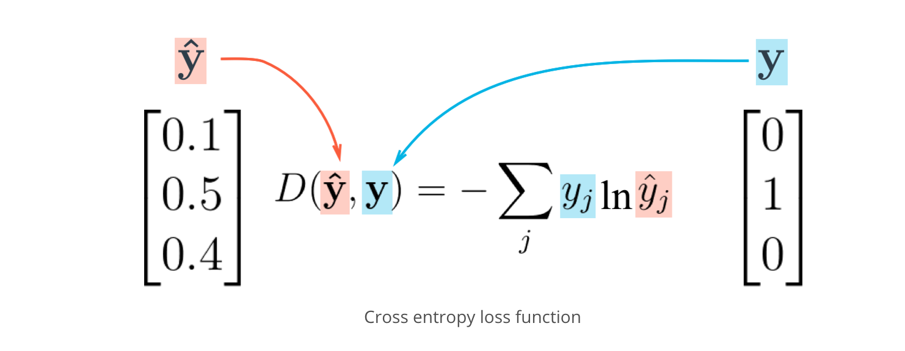

# Neural Networks

### Notes

**perceptron**: the individual nodes that make up a neural network. They look at
input data and decide how to categorize the data.

**weights** (w): The value an input is multiplied by. This is adjusted based on any
errors in categorization. A higher weight means the the network considers an input
more important.

**linear combination**: the math done at the perceptron which sums weights and inputs.

**activation function**: these are functions that decide, given inputs to the node,
what the nodes output should be. One example is a _Heaviside step function_ where
the fn returns 0 if the linear combination is less than 0, or 1 if the linear combination
is greater than 0.

**bias** (b): as a linear model, it lets us move our model up or down the Y axis.


### Q&A

Q. What is the difference between linear and logistic regression?

A. 

---

Q. What is an epoch?

A. An epoch is a single pass forward and backwards through a whole dataset.


### Tensorflow

#### Linear Models

```
import tensorflow as tf

x = tf.Variable(5)

init = tf.global_variables_initializer()
with tf.Session() as sess:
    sess.run(init)

n_features = 120
n_labels = 5
# returns tensor with random values from a normal distribution whose magnitude
# is no more than 2 STD from mean.
weights = tf.Variable(tf.truncated_normal((n_features, n_labels)))

n_labels = 5
# tf.zeros returns a tensor with all zeros
bias = tf.Variable(tf.zeros(n_labels))
```

#### Softmax

This squashes its inputs, called logits, to be between 0 and 1  and normalizes
output so that they all sum to 1. This means output sums to a categorical
probability distribution.

```
import tensorflow as tf


def run():
    output = None
    logit_data = [2.0, 1.0, 0.1]
    logits = tf.placeholder(tf.float32)

    softmax = tf.nn.softmax(logits)

    with tf.Session() as sess:
        output = sess.run(softmax, feed_dict={logits: logit_data})

    return output
```

### Cross-Entropy

We can use a cross-entropy function as a cost function for classification with
one-hot encoded labels. We can get this by taking the sum of the one-hot matrix
multiplied by the natural log of the softmax data.



```
cross_entropy = -tf.reduce\_sum(tf.multiply(one\_hot\_encoding, tf.log(softmax)))
```

#### Mini-Batching

This is used for training on subsets of data rather than the entire dataset so that
we can store the entire dataset in memory.

A floating point 32-bit base-2 number takes 4 bytes of memory (float32). For float64
this would be 8 bytes of memory.

1. calculate memory requirements

```
train_features Shape: (55000, 784) Type: float32
```

The memory requirements for this would be

```
((55000 * 784) * 8) = 172480000
```

That's 174MB of memory which means we could run it on most systems, but if it was
very large we would want to batch so that we can keep the entire dataset in memory.
Since we're running most of this on GPUs, then we need a smaller dataset usually,
since GPU memory is usually not as high as system memory.


2. Compute batch size

```
n_input = 784
n_classes = 10

# Features and Labels
features = tf.placeholder(tf.float32, [None, n_input])
labels = tf.placeholder(tf.float32, [None, n_classes])
```

The none we use as a placeholder here is for batch size. At run time we can feed
in batch size of greater than 0 into the placeholder.

Here is a simple computation of batch size and num batches.

```
features is (50000, 400)
batch_size = 128

50000 / 128 = 390.625

num_batches = 391
last\_batch_size = 80
```

And a function for batching would be like

```
import math
def batches(batch_size, features, labels):
    """
    Create batches of features and labels
    :param batch_size: The batch size
    :param features: List of features
    :param labels: List of labels
    :return: Batches of (Features, Labels)
    """
    assert len(features) == len(labels)
    output_batches = []

    sample_size = len(features)
    for start_i in range(0, sample_size, batch_size):
        end_i = start_i + batch_size
        batch = [features[start_i:end_i], labels[start_i:end_i]]
        output_batches.append(batch)

    return output_batches
```

And a tf session using this would look like

```
batch_size = 128

init = tf.global_variables_initializer()

with tf.Session() as sess:
    sess.run(init)

    for batch_features, batch_labels in batches(batch_size, train_features, train_labels):
        sess.run(optimizer, feed_dict={features: batch_features, labels: batch_labels})

    test_accuracy = sess.run(
        accuracy,
        feed_dict={features: test_features, labels: test_labels})
```

