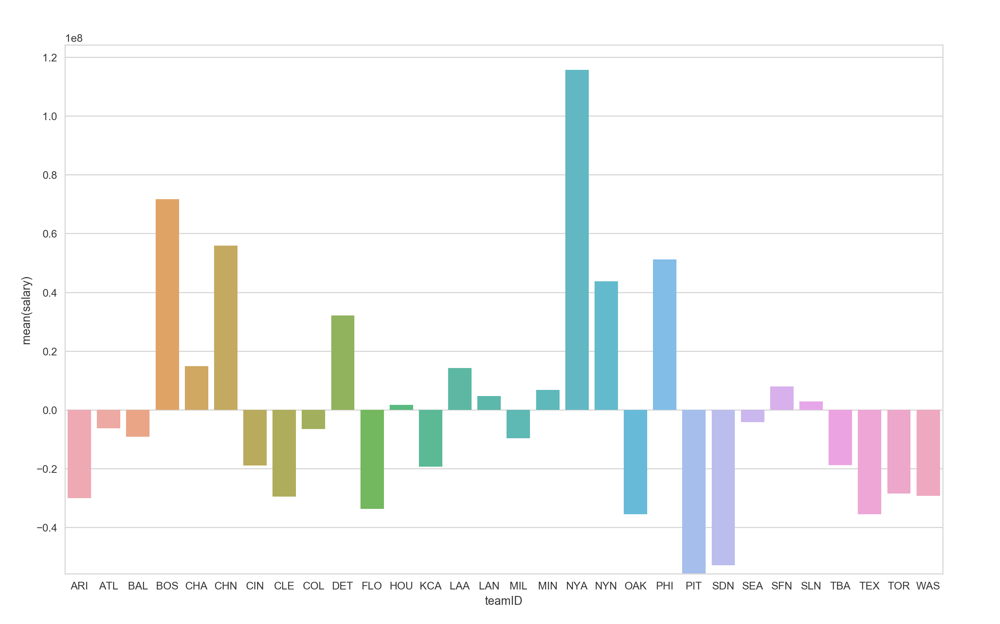

# Intro To Data Analysis

https://www.udacity.com/course/intro-to-data-analysis--ud170

## Final Project

This is the final project for Intro To Data Analysis by Udacity that goes
through the entire data analysis process.

1) Question
2) Wrangle
3) Explore
4) Draw Conclusions
5) Communicate

Objective:
Show that the learner can go through the entire data analysis process!

Instructions:
https://classroom.udacity.com/courses/ud170/lessons/5442503234/concepts/54545126720923#

Grading
https://docs.google.com/document/d/1YzdSG-rYJuNSprUppkpeno_lobQ7izUxYj_sCUrY3Rg/pub?embedded=true

- The data set used can be found in `baseball_stats/`
  -> structure listed [here](baseball_stats/core/data_info.txt)

### Question

What is the distribution of team salaries?

### Findings

The python code to generate this analysis is located at `analysis.py`

The question I wanted to answer was which team spends the most on player salaries.
I wanted a way to visualize which teams spend the most on players relative to the
mean.

To keep this simple, I only used salary data from 2010. Then I calculated the
difference from the mean for each of the teams salaries, and showed the data on
a barplot.

This barplot shows that the New York Yankees (`NYA`) spends the most on player
salaries, and that the Pittsburgh Pirates (`PIT`) spends the least, for the year
2010.
