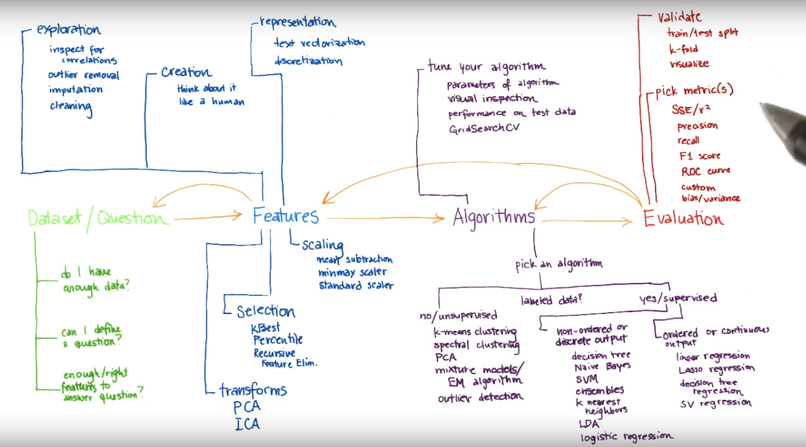

# Intro To Machine Learning

https://www.udacity.com/course/intro-to-machine-learning--ud120

## Topics:

- [naive bayes](naive_bayes.md)
- [svm](svm.md)
- [decision trees](decision_trees.md)
- [regressions](regressions.md)
- [clustering](clustering.md)
- [feature scaling](feature_scaling.md)
- [text learning](text_learning.md)
- [feature selection](feature_selection.md)
- [pca](pca.md)
- [validation](validation.md)

## ML Process:

1. Data Analysis: investigate your data; define a question; find the data that could help you
answer it.
2. Feature Selection: finding the right feature spaces for your algorithm.
3. Algo Selection: find the right algorithm to use and the right parameter tunes.
4. Validation: make sure your analysis is trustworthy.

