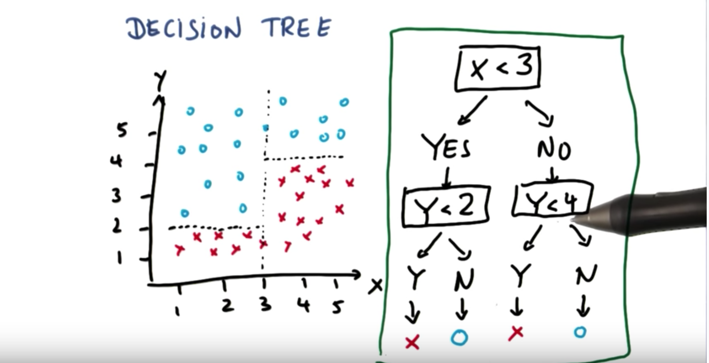

# Decision Trees

These decision trees allow us to do non-linear decision making with simple
linear decision surfaces.





`good`: They're really easy to use, and you can understand them graphically better than SVM.

You can build bigger classifiers with decision trees via ensemble methods.

`bad`: They are prone to over-fitting.


### More Info

### Q&A

Q. What is entropy in the context of decision trees?

A. Entropy is a measure of impurity when splitting. In the case of `a/b` classes
entropy can be defined like

```
Entropy = - p(a)*log(p(a)) - p(b)*log(p(b))
```

If all examples are the same class then entropy = 0 (min)
If all examples are evenly split between classes then entropy = 1 (max)

---

Q. What is information gain in the context of decision trees?

A. information gain = entropy(parent) - ([weightedAvg] of entropy(children))

By comparing the entropy before and after the split, we can get the entropy gained
or lost by doing the split.

---

Q. How does a decision tree decide where to split the data?

A. It uses entropy as a measure of the impurity when splitting. We can use entropy
in our information gain calculation to determine if entropy is gained or lost from
a particular split. From there, we try to maximize the information gain of each
split.

---

Q. What is the bias-variance dilemma?

A. A high bias machine learning algo almost ignores the data, and a high variance
machine learning algo is very sensitive to the data. We try to hit a sweet spot
on this continuum to create the best algo.

### Example

```
from sklearn import tree

X = [[0,0], [1,1]]
Y = [0,1]

clf = tree.DecisionTreeClassifier()
clf.fit(X,Y)
clf.predict([2.,2.])

OUT> [1]
```
