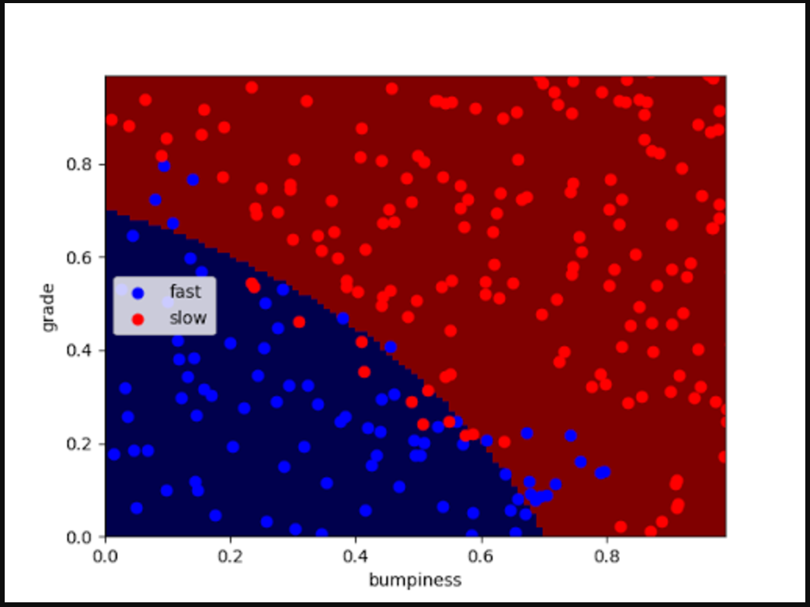

# Naive Bayes

Bayes at a conceptual level is just

```
(prior probability) * (test evidence) = (posterior probability)
```

a more detailed intro can be found [here](https://betterexplained.com/articles/an-intuitive-and-short-explanation-of-bayes-theorem/).

We use bayes in machine learning as an algo to find a decision surface, among other things.

A _decision surface_ is used in supervised classification problems and helps us
distinguish the boundary between classes, so we can easily classify new data points.

about bayes in ml:

`good`: only takes a small number of training samples. very easy to scale up.

`bad`: assumes that the values of a particular feature are independent of the value
of any other feature. i.e A fruit being red and round are independent to it being
considered an apple.

## More Info

https://betterexplained.com/articles/an-intuitive-and-short-explanation-of-bayes-theorem/
http://machinelearningmastery.com/naive-bayes-for-machine-learning/
https://en.wikipedia.org/wiki/Naive_Bayes_classifier

## Q&A

**Q.** Why is it called naive bayes? How is it different from regular bayes?

**A.** It is called naive bayes because when we calculate our hypothesis (h), instead
of trying to calculate the values of each attribute value has on our hypothesis like
P(d1, d2|h) we just _assume_ that they are each conditionally independent, and
can be calculated like `P(d1|h) * P(d2|h)`

"This is a very strong assumption that is most unlikely in real data, i.e. that
the attributes do not interact. Nevertheless, the approach performs surprisingly
well on data where this assumption does not hold."

---

**Q.** What is the difference between Gaussian naive bayes and just plan old naive bayes?

**A.** We use Gaussian naive bayes when dealing with continuous (real-world) data.
In this case, we assume a Gaussian distribution on the data.

---

**Q.** How do we determine accuracy of naive bayes?
**A.** accuracy = (number of points correctly classified) / (all points in test set)

```
from sklearn.metrics import accuracy_score
accuracy_score(y_true, y_pred)
```

## Generic Example

```
import numpy as np
from sklearn.naive_bayes import GaussianNB

# features
X = np.array([[-1, -1], [-2, -1], [-3, -2], [1, 1], [2, 1], [3, 2]])
# labels
Y = np.array([1, 1, 1, 2, 2, 2])

# create classifier
clf = GaussianNB()
# we fit the decision surface using the classifier
clf.fit(X, Y)

# then we predict where a new feature will sit
print(clf.predict([[-4, -1]]))

OUT> [1]
```

And a decision boundary for a classifier might look like this



