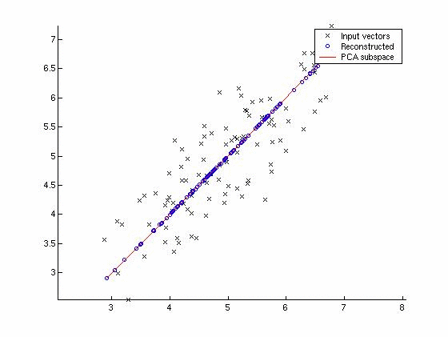

# Principal Component Analysis (PCA)

PCA is a technique for linear transformation that we can apply to our data to reduce
its dimensionality. The main goal is to detect correlation in data between variables, and if the
correlation exists, reduce the dimensionality of those variables.

It finds the directions of maximum variance in high-dimensional data and then
projects it onto a smaller dimension subspace while still retaining most of the
information.

The visual representation looks like this



### Q&A

Q. What are the two ways we can condense features to get a better result?

A. We can just remove features, since we might think some features are causing
too much variance. Or we could create a composite feature that more directly probes
the underlying phenomenon. We use PCA to reduce the dimensionality of our features
(we take a lot of features and combine them to make only a few)

---

Q. What is PCA?

A. A systematic way to transform input features into principal components. These n
principal components we can use as new features. The principal components are always
in the direction of maximum variance. All PCAs are perpendicular to eachother,
so we can treat them as independent features. The number of PCs you can have is
the number of input features you have.

---

Q. How do we determine the principal component?

A. The principal component of a dataset is the linear direction in a dataset that
has the largest variance. We choose this criteria because we want to retain
as much information about the dataset as possible.

---

Q. How do we calculate information loss in PCA?

A. The information lost is calculated by he distance between a given point
as it appeared originally and it's new point in space after PCA has occurred.
And it is a fact that if we project points onto the principal component (the line
with most variance), then we are decreasing our information loss.

---

Q. When should we use PCA?

A. Perhaps we think there are latent features in our data, we can use PCA to make
these latent features "visible". The second use case is in dimension reduction in
the case that you have highly-dimensional data and need to visualize your data, or
perhaps you need to reduce the dimensions of data before you put the data through
your ml algos.

---

Q. What is an Eigenface?

A. It is a name given to a set of eigenvectors when they are used in facial
recognition using ml.

---

Q. How do we determine the number of principal components to use?

A. We kind of have to figure it out unfortunately. We can train on a different number
of PCs and then see how accuracy responds, and then cut off the number of PCs when
it becomes apparent that adding more PCs doesn't help with discrimination.

### Example

```
import numpy as np
from sklearn.decomposition import PCA

X = np.array([[-1, -1], [-2, -1], [-3, -2], [1, 1], [2, 1], [3, 2]])

pca = PCA(n_components=2)
pca.fit(X)


print(pca.explained_variance_ratio_)
```
