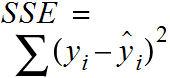

# Linear Regression

This is an algo we use for continuous supervised machine learning. To learn info
about a continuous set of data points.

### More Info

http://machinelearningmastery.com/linear-regression-for-machine-learning/

### Q&A

Q. How do we measure performance of a regression?

A. We take the r-squared score on both the test and train dataset and then compare
their scores. A higher r-squared score is better, with a max of 1.0. When we
compare the test and train dataset if the test r-squared is vastly lower than
train r-squared then you might have performance issues.

---

Q. How do we measure linear regression errors?

A.

```
error = (actual_y) - (expected\_y)
```

---

Q. What will a good regression fit minimize?

A. A good fit will minimize the sum of the squared errors on all data points.


This is the sum squared error (SSE) equation that is the cost function for measuring
linear regression model performance. The larger the sum of squared errors the
worse the the model fit.



The algos we can use to try minimize SSE:

- ordinary least squares (OLS)
- gradient descent

However, there is one tripping point. As you increase the number of data points,
your SSE will increase, but this doesn't mean your model is doing any worse, it
just means that you're adding data points.

---

Q. Is there a better way to measure errors than SSE?

A. Yes! We can take the r^2 (r-squared) of a model.

It asks "how much of my change in the output (y) is explained by the change in my
input (x)"

The good thing about r-squared is that it's independent of the number of
training points you have, unlike SSE.

---

Q. How are regression and classification different?

A.

| property | supervised classification | regression |
| ------------- |:-------------:| -----:|
| output type | discrete | continuous |
| what are we trying to find? | decision boundary | best fit line |
| evaluation | accuracy | r-squared |

---

Q. How do we remove outliers from our data?

A. We can train, then remove ~10% of points with largest residual error, then
re-train to see if you perform better.

### Example

```
from sklearn import linear_model

X = [[0, 0], [1, 1], [2, 2]]
Y = [0, 1, 2]

reg = linear_model.LinearRegression()

# fit the regression line to the data
reg.fit(X, Y)

# read out the coefficients (slope)
reg.coef_

# read out the intercept
reg.intercept_

# stats on test dataset (r-squared)
reg.score(x_test, y\_test)

# stats on training dataset (r-squared)
reg.score(x_train, y\_train)
```
